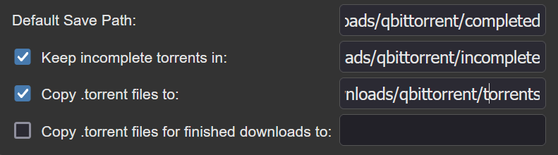

# Docker Stacks
## *arr stack
When running in Proxmox CTs, put this in config file first:
```
lxc.cgroup2.devices.allow: c 10:200 rwm
lxc.mount.entry: /dev/net dev/net none bind,create=dir
lxc.mount.entry: /dev/net/tun dev/net/tun none bind,create=file
```
Make directories on share:
```
mkdir -p downloads/qbittorrent/{completed,incomplete,torrents}
```
Map it as follows in qbittorrent:

Test VPN connections:
```
docker exec -it prowlarr bash
wget -qO- https://ipinfo.io
```
```
docker exec -it qbittorrent bash
wget -qO- https://ipinfo.io
```
